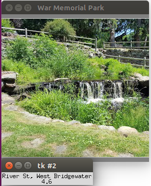

**Pages:** | [***Home***](https://rickyroze.github.io/SoftDesFinalProject/) |  [GIS](https://rickyroze.github.io/SoftDesFinalProject/GIS "GIS info page") | [Technical Page](https://rickyroze.github.io/SoftDesFinalProject/TechnicalPage "Technical Page") | [Results Page](https://rickyroze.github.io/SoftDesFinalProject/ResultsPage "Results") | [Our Story](https://rickyroze.github.io/SoftDesFinalProject/OurStory "Our Story") |
### Maps API Page
To select an latitude/longitude to look up, simply click on the area in the satellite image you are interested in. The program will map this pixel to a longitude and latitude that Google Places can use to find further information.

After entering a search radius in meters, the program will give you the names of local parks in that radius, as well as the google images associated with them. 

For example this image pops up as a local park in Plymouth County Massachusetts:

It also revelas the rating for the area (based on user reviews), for Plymouth County the rating is: 3.9/5 stars, the website for the park, (if applicable) and the specific address for the park.

The same information can be found by clicking a different pixel in the satellite image and searching in a new area. 

[***Home***](https://rickyroze.github.io/SoftDesFinalProject/)
