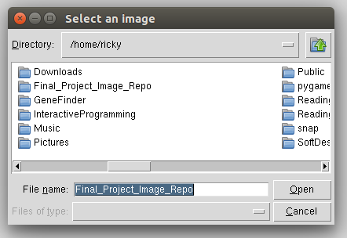
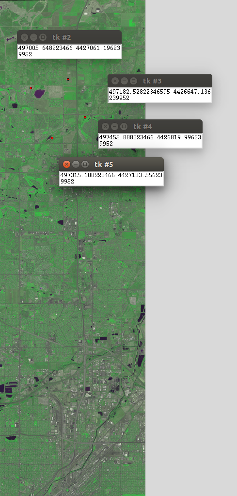
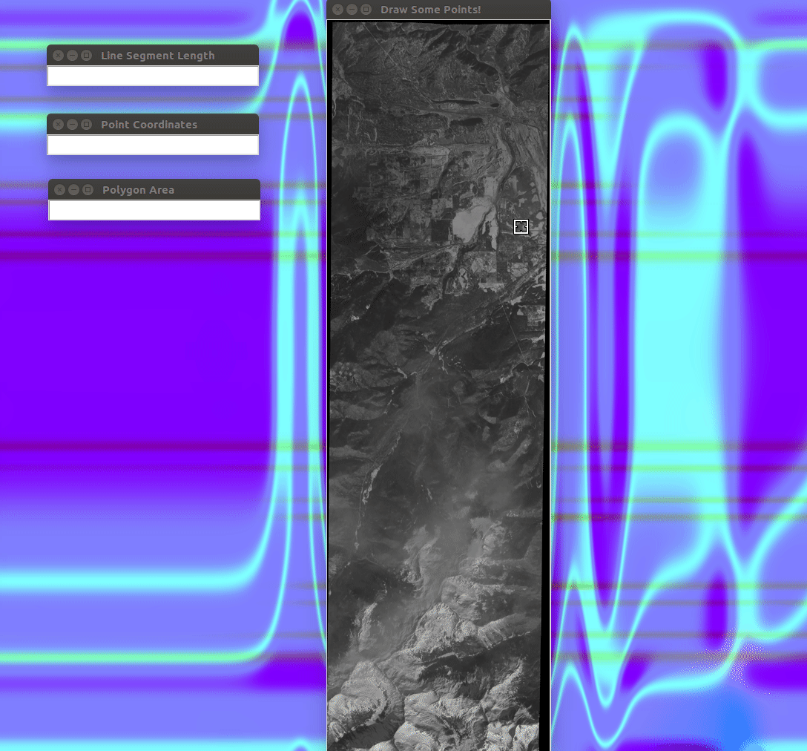
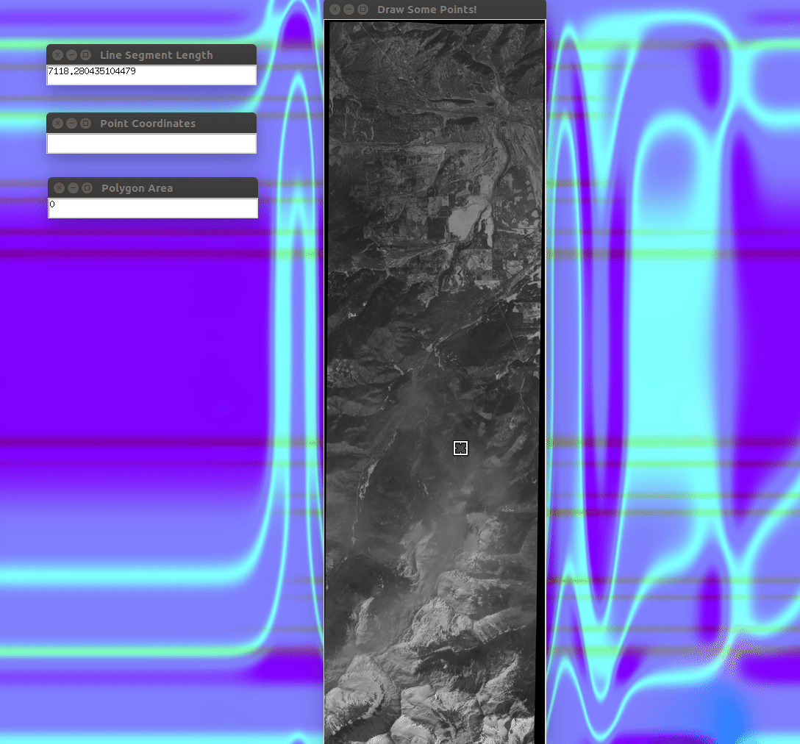
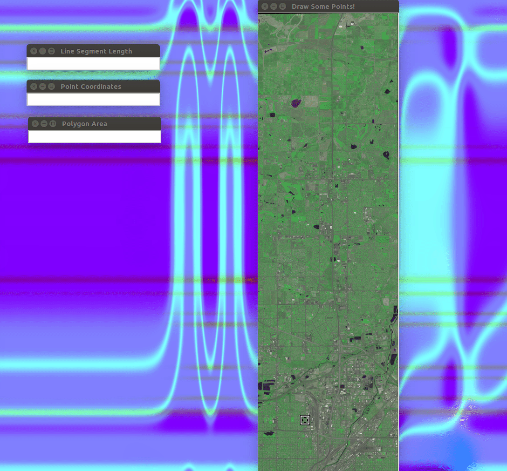

**Pages:** | [***Home***](https://rickyroze.github.io/SoftDesFinalProject/) |  [Geographic and Satellite Information](https://rickyroze.github.io/SoftDesFinalProject/GIS "GIS info page") | [Google Maps](https://rickyroze.github.io/SoftDesFinalProject/MapPage "Google Maps API page") | [Process and Implementation](https://rickyroze.github.io/SoftDesFinalProject/TechnicalPage "Technical Page") | [Our Story](https://rickyroze.github.io/SoftDesFinalProject/OurStory "Our Story") |
### Outcomes and Application
Here is a bit of our program in action!

This is an image of our file selector.

The next image demonstrates how a user can select a pixel in the image and have it display the coordinates
in UTM.
 

The gif below shows the program determining the length of a user input path, you can also see the zoom capabilities in action!

The program can also extimate the area of an input polygon, as shown below.

Finally, this gif shows how a user can click a point on the satellite image to find attraction information and images of nearby parks!

 

[***Home***](https://rickyroze.github.io/SoftDesFinalProject/)
