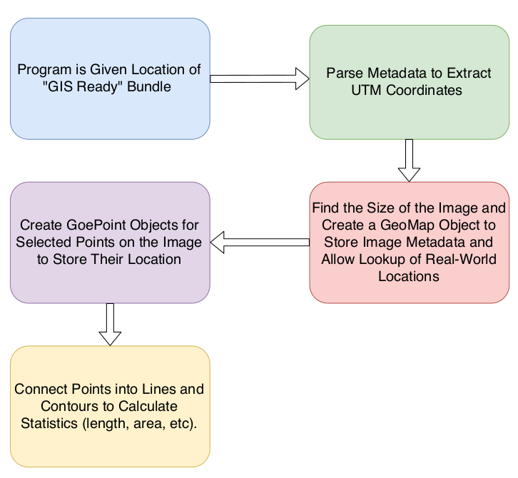
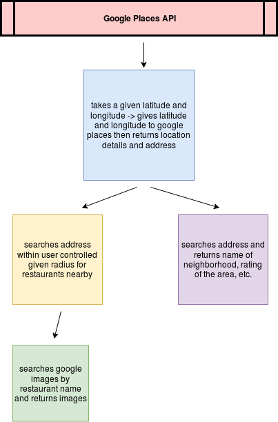
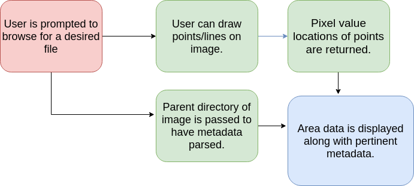

**Pages:** | [***Home***](https://rickyroze.github.io/SoftDesFinalProject/) | [GIS](https://rickyroze.github.io/SoftDesFinalProject/GIS "GIS info page") | [Maps API Page](https://rickyroze.github.io/SoftDesFinalProject/MapPage "Google Maps API page") | [Results Page](https://rickyroze.github.io/SoftDesFinalProject/ResultsPage "Results") | [Our Story](https://rickyroze.github.io/SoftDesFinalProject/OurStory "Our Story") |
### Technical Page
How the Program Works:
+ The general flow of the program can be broken into three modules. The Image Processing, the Google Maps API, and the GUI. The flow of information goes from the Image Processing to the Maps API and ends in the GUI. Below we have broekn down each of those three modules to give you a better sense of what happens in each.

Image Processing

Maps API

GUI

Implementation: 
To run this program you will need to install numpy,googleplace,PIL,geopy.geocoders,io,cv2,utm,os,shapely,and Tkinter. After this clone the repositoy (https://github.com/rickyroze/SoftDesFinalProject.git) and run Final.py. You will be asked to select an image to run the program with, you can either use an image we have provided from USGS (also in this repository:https://github.com/aidenclpt/Final_Project_Image_Repo) or import your own satellite images. After this run the program and the GUI will pop up allowing you full access to the program! 

+ Attributions: United States Geological Survey (USGS), Google Places API Documentation, Orbview3

[***Home***](https://rickyroze.github.io/SoftDesFinalProject/)

[//]: # 

